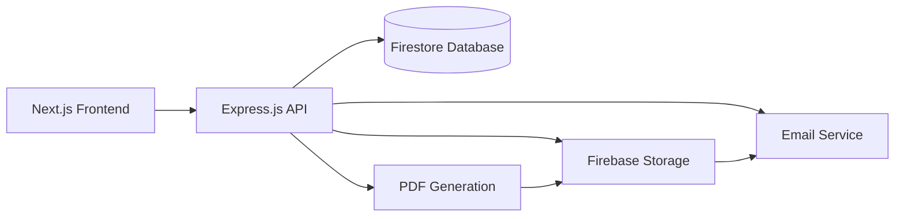

<div align="center">

# 🔧 Steel Wheel Auto Invoice Generator 🚗

[](https://nextjs.org/)
[](https://firebase.google.com/)
[](https://resend.com/)
[](https://pdf-lib.js.org/)


**A professional invoice generation system for Steel Wheel Auto Limited**

*Secure authentication | Custom PDF invoices | Automated email delivery*

</div>

## ✨ Features

- 🔒 **Secure Authentication** - Firebase authentication with email/password
- 📝 **Invoice Creation** - Intuitive form with validation
- 📃 **PDF Generation** - Professional PDFs with company logo and formatting
- 📧 **Email Delivery** - Automated emails to customers via Resend API
- 💾 **Data Storage** - Secure storage with Firebase Firestore
- 🎨 **Modern UI** - Responsive design with animations and dark theme
- 🧪 **Comprehensive Testing** - Unit, API, and service tests

## 🏗️ Architecture



## 📋 Project Structure

```
/
├── app/                 # Next.js frontend pages
├── components/          # UI components
├── lib/                 # Frontend utilities
├── public/              # Static assets
├── services/            # Backend services
│   ├── firebase.js      # Firebase integration
│   ├── pdf.js           # PDF generation
│   └── email.js         # Email sending service
├── __tests__/           # Test suites
├── server.js            # Express.js backend
└── config/              # Application configuration
```

## 🚀 Setup Instructions

### Prerequisites

- Node.js 18+ and npm
- Firebase account
- Resend API account

### Installation

1. **Clone the repository**
   ```bash
   git clone https://github.com/Patrickscott999/steel_wheel_auto_completed_version.git
   cd steel_wheel_auto_completed_version
   ```

2. **Install dependencies**
   ```bash
   npm install
   ```

3. **Create environment variables file**
   
   Create a `.env` file in the project root with the following variables:

   ```env
   # Firebase Configuration
   FIREBASE_PROJECT_ID=your-project-id
   FIREBASE_CLIENT_EMAIL=your-client-email
   FIREBASE_PRIVATE_KEY="your-private-key"
   FIREBASE_STORAGE_BUCKET=your-storage-bucket

   # Resend Configuration
   RESEND_API_KEY=your-resend-api-key

   # Server Configuration (Optional)
   PORT=3000
   ```

4. **Start the development servers**
   ```bash
   # Terminal 1: Start the Next.js frontend
   npm run dev

   # Terminal 2: Start the Express backend
   node server.js
   ```

5. **Access the application**
   
   Open your browser and navigate to [http://localhost:3000](http://localhost:3000)

## 🔌 API Endpoints

### 📤 POST /api/invoices
*Creates a new invoice, generates a PDF, saves it to Firebase Storage, and sends an email to the customer.*

**Request Body:**
```json
{
  "customerName": "John Doe",
  "customerEmail": "john@example.com",
  "customerAddress": "123 Main Street, Kingston, Jamaica",
  "vehicleMake": "Toyota",
  "vehicleModel": "Camry",
  "vehicleYear": "2023",
  "licensePlate": "ABC123",
  "service": "Oil Change",
  "price": 5000,
  "invoiceDate": "2025-05-05"
}
```

**Headers:**
```
Authorization: Bearer <firebase-id-token>
```

**Response:**
```json
{
  "message": "Invoice created and sent successfully",
  "invoiceId": "abc123",
  "pdfUrl": "https://storage.url/to/pdf",
  "emailId": "email-id-from-resend"
}
```

### 📥 GET /api/invoices
*Fetches all invoices for the authenticated user.*

**Headers:**
```
Authorization: Bearer <firebase-id-token>
```

**Response:**
```json
[
  {
    "id": "abc123",
    "customerName": "John Doe",
    "customerEmail": "john@example.com",
    "customerAddress": "123 Main Street",
    "vehicleMake": "Toyota",
    "vehicleModel": "Camry",
    "vehicleYear": "2023",
    "licensePlate": "ABC123",
    "service": "Oil Change",
    "price": 5000,
    "invoiceDate": "2025-05-05",
    "pdfUrl": "https://storage.url/to/pdf",
    "createdAt": "2025-05-05T12:34:56.789Z"
  }
]
```

## 🧪 Testing

The application includes comprehensive test suites covering components, services, and API endpoints:

```bash
# Run all tests
npm test

# Run tests in watch mode (for development)
npm run test:watch
```

Test suites include:
- Authentication flow testing
- Form validation testing
- PDF generation verification
- Email service testing
- API endpoint testing

## 🔍 Performance Optimization

This application has been optimized for performance in several key areas:

1. **Code Splitting** - Components are loaded on-demand
2. **Image Optimization** - Efficient loading of images and resources
3. **API Caching** - Reduced redundant calls to backend services
4. **Bundle Size Management** - Minimized JavaScript payload

Refer to the `performance-optimization.md` file for more details and implementation steps.

## 🌐 Browser Compatibility

The application has been tested and verified to work on the following browsers:

- Chrome (latest 2 versions)
- Firefox (latest 2 versions)
- Safari (latest 2 versions)
- Edge (latest version)
- Mobile browsers (iOS Safari, Android Chrome)

See `browser-compatibility-testing.md` for detailed compatibility testing information.

## 👨‍💻 Development

### Adding New Features

1. Create a new branch: `git checkout -b feature/your-feature-name`
2. Implement your changes
3. Write tests for your new feature
4. Submit a pull request

### Code Style

This project follows the Next.js style guide. Run linting with:

```bash
npm run lint
```

## 📄 License

This project is proprietary and is owned by Steel Wheel Auto Limited. Unauthorized use, modification, or distribution is prohibited.

## 📧 Contact

For questions or support, contact Steel Wheel Auto Limited at steelwheelauto@gmail.com.

---

<div align="center">

**Built with ❤️ for Steel Wheel Auto Limited**

</div>

## Security

- All API keys are stored securely in the `.env` file
- Firebase Authentication is used to protect all API endpoints
- PDF files are stored in Firebase Storage with secure access controls
